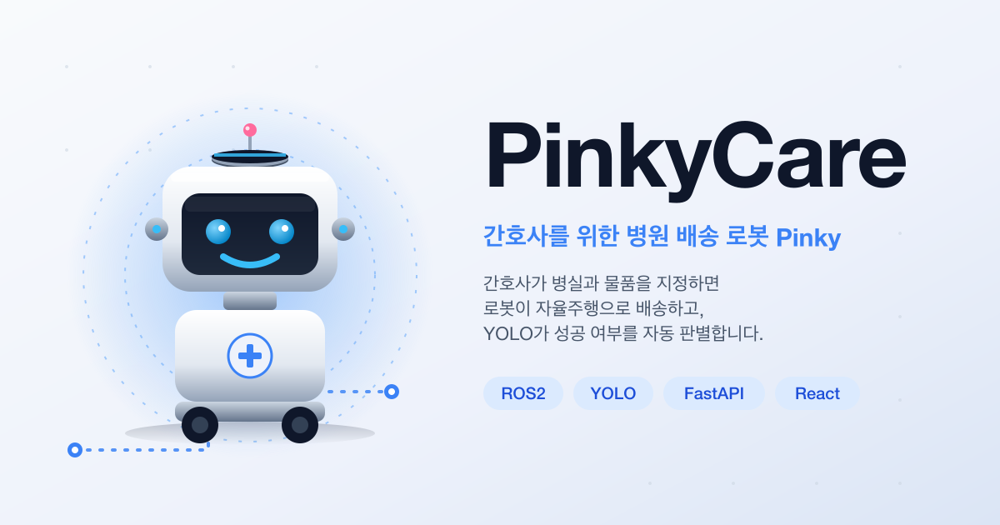

# PinkyCare



병원 간호 로봇 **Pinky**의 배송 관리 시스템. 간호사가 웹에서 배송할 병실과 물품을 선택하면, 로봇이 자율주행으로 이동하고 도착 지점에서 YOLO가 배송 성공/실패를 자동 판별합니다.

이 저장소는 **모노레포**로, 프론트엔드 · 백엔드 · YOLO · ROS2 워크스페이스를 함께 관리합니다.

- **현재 단계**
  - ✅ 프론트엔드 (React + TS + Vite) 3화면 완성 + SSE 실시간 반영
  - ✅ FastAPI 백엔드 (REST + SSE, 인메모리 저장, 41 pytest)
  - ✅ YOLO v1 학습 완료 (O/X 카드 판별, mAP@0.5 = 0.977) — 백엔드가 `ARRIVED` 시점에 자동 호출
  - ✅ 실패 시 간호사 결정 분기(`AWAITING_NURSE`) + 검증 완료 후 로봇 자동 복귀 통합
  - 🚧 ROS2 자율주행 노드 (Nav2) — 팀원 담당, 백엔드 계약 연결 중
- **역할 분담**
  - 프론트엔드 · 백엔드 · YOLO 판별: 정수진
  - 로봇 자율주행 (Nav2, ROS2): 팀원 담당

---

## 1. 폴더 구조 (모노레포)

```
pinky-care/
├── frontend/              # React + TS + Vite (간호사용 웹 UI)
├── backend/               # FastAPI (배송 관리 + SSE + YOLO 판별)
├── yolo/                  # YOLO 촬영·학습 워크플로 (노트북/스크립트)
├── ros2_ws/               # ROS2 워크스페이스 (자율주행 노드)
├── docs/                  # 팀 공용 문서
│   ├── api-spec.md              # FastAPI 엔드포인트/데이터 모델/SSE
│   ├── delivery-scenario.md     # 배송 시나리오 v3 (비개발자용)
│   ├── robot-integration.md     # ROS2 ↔ 백엔드 통합
│   ├── ros2-coordination.md     # 팀원 조율 항목
│   ├── yolo-plan.md             # YOLO 데이터/학습 로드맵
│   └── diagrams/                # excalidraw 원본 + 렌더 PNG
└── README.md              # (이 파일)
```

각 서브 프로젝트의 상세 설명은 하위 README 참고:

- [`frontend/README.md`](frontend/README.md)
- [`backend/README.md`](backend/README.md)
- [`yolo/README.md`](yolo/README.md)
- [`ros2_ws/README.md`](ros2_ws/README.md)

---

## 2. 전체 시스템 아키텍처

### 2.1 컴포넌트 구성

```
┌─────────────────────────────────────────────────────────────────┐
│                        PinkyCare 시스템                          │
│                                                                 │
│  ┌──────────────┐        ┌──────────────┐                       │
│  │   간호사      │        │  ROS2 노드    │                       │
│  │   웹 UI      │        │  (Nav2)      │                       │
│  │  frontend/   │        │  ros2_ws/    │                       │
│  └──────┬───────┘        └──────┬───────┘                       │
│         │                        │                              │
│    REST │ SSE               REST │                              │
│         │                        │                              │
│         ▼                        ▼                              │
│  ┌──────────────────────────────────────┐                       │
│  │           FastAPI 백엔드              │                       │
│  │           backend/                    │                       │
│  │  · 배송 요청/조회                     │                       │
│  │  · 상태 전이 관리                     │                       │
│  │  · SSE 브로드캐스트                   │                       │
│  │  · YOLO 자동 호출 (ARRIVED 시점)      │                       │
│  └──────┬───────────────────────┬───────┘                       │
│         │                       │                               │
│         │                  로컬 │                               │
│         │                       ▼                               │
│         │              ┌──────────────┐                         │
│         │              │  YOLO 추론    │                         │
│         │              │  (backend/    │                         │
│         │              │   services/)  │                         │
│         │              └──────────────┘                         │
│         │                                                       │
│         ▼                                                       │
│    (배송 상태 실시간 표시)                                       │
└─────────────────────────────────────────────────────────────────┘
```

### 2.2 배송 시나리오 (v3)


간호사가 화면에서 방·물품을 선택해 요청하면, 로봇이 자율주행으로 병실까지 이동합니다. 도착 시 카메라를 켜고 **30초 창** 동안 카드 이미지를 관제 시스템에 보내고, 백엔드의 YOLO가 창이 끝나는 순간 결과를 판정합니다.

- **성공(O)** — 😊 웃음 LCD → 자동으로 간호실 복귀
- **실패(X · 혼동 · 인식 실패)** — 로봇은 병실에 대기, 간호사에게 알림(`AWAITING_NURSE`)
  - 간호사가 **"바로 복귀"** 선택 → 😢 슬픔 LCD → 자동 복귀
  - 간호사가 **"대기해, 내가 갈게"** 선택 → 병실에서 최대 5분 대기 → 간호사와 함께 복귀

어느 경로든 마지막은 🏠 **간호실 도착 · 다음 배송 대기**로 마무리됩니다.

> 개발자용 상세 흐름·API 시퀀스는 [`docs/delivery-scenario.md`](docs/delivery-scenario.md), [`docs/api-spec.md`](docs/api-spec.md), [`docs/robot-integration.md`](docs/robot-integration.md) 참고.

### 2.3 상태 전이

```
REQUESTED ──► MOVING ──► ARRIVED ──► VERIFYING ─┬─► SUCCESS         (terminal)
                                                │
                                                ├─► AWAITING_NURSE ─┬─► SUCCESS  (terminal)
                                                │                    └─► FAILED   (terminal)
                                                │
                                                └─► FAILED           (terminal)
```

- `VERIFYING`: 30초 창 동안 YOLO가 프레임 판별 중
- `AWAITING_NURSE`: YOLO가 실패로 판정했지만 간호사의 결정(즉시 복귀 / 대기 후 동반 복귀)이 필요할 때만 진입
- 정의되지 않은 전이는 백엔드가 `409 INVALID_TRANSITION`으로 거부

### 2.4 화면 흐름 (frontend)

```
┌───────────────┐  배송 시작  ┌───────────────────┐  terminal  ┌─────────────────┐
│   MainPage    │ ───────────► │ DeliveryProgress  │ ─────────► │ DeliveryResult  │
│  (병실/물품)   │              │      Page         │            │      Page       │
└───────────────┘              └───────────────────┘            └─────────────────┘
        ▲                                                                │
        │                                재시도(FAILED) / 홈으로          │
        └────────────────────────────────────────────────────────────────┘
```

`DeliveryProgressPage`는 `AWAITING_NURSE` 상태에 진입하면 "바로 복귀 / 대기해, 내가 갈게" 두 버튼을 표시하고, 응답을 `POST /deliveries/{id}/nurse-return-command`로 전송합니다.

---

## 3. 개발 (현재 시점)

```bash
# 백엔드 (터미널 1)
cd backend
python3 -m venv .venv
.venv/bin/pip install -e .
.venv/bin/uvicorn app.main:app --reload   # http://localhost:8000

# 프론트엔드 (터미널 2)
cd frontend
npm install
npm run dev        # http://localhost:5173

# ROS2 (팀원 담당)
cd ros2_ws
# colcon build && source install/setup.bash
```

로봇/YOLO 없이도 상태 진행을 시뮬레이션하려면 `curl`로 PATCH 두 개(`/robot-status`, `/verification`)를 순서대로 쳐주면 됩니다. 예시는 [`backend/README.md`](backend/README.md) 참고.

실제 YOLO 판별을 웹캠으로 붙이려면 [`yolo/README.md`](yolo/README.md)의 `detect_ox.py --post-to <deliveryId>` 사용.

---

## 4. 관련 문서

- **API 명세서**: [`docs/api-spec.md`](docs/api-spec.md) — FastAPI 엔드포인트, 데이터 모델, SSE 스키마
- **배송 시나리오 (v3)**: [`docs/delivery-scenario.md`](docs/delivery-scenario.md) — 비개발자용 전체 흐름
- **로봇 통합**: [`docs/robot-integration.md`](docs/robot-integration.md) — ROS2 ↔ 백엔드 계약
- **ROS2 팀원과 조율 항목**: [`docs/ros2-coordination.md`](docs/ros2-coordination.md) — 인터페이스/좌표/카메라/이상상황 결정
- **YOLO 작업 계획**: [`docs/yolo-plan.md`](docs/yolo-plan.md) — 데이터셋 → 학습 → 백엔드 통합 로드맵
- **프론트 타입 정의(계약서)**: [`frontend/src/types/delivery.ts`](frontend/src/types/delivery.ts)

---

## 5. 로드맵

- [x] Vite + React + TS + Tailwind + Router 세팅
- [x] 타입/상수/서비스 인터페이스 정의
- [x] Mock 서비스 구현
- [x] 메인/진행/결과 3개 화면 구현
- [x] 배송 상태 실시간 반영 훅
- [x] 백엔드 API 명세서 작성
- [x] 모노레포 구조로 전환
- [x] FastAPI 백엔드 구현 (REST + SSE, 인메모리 저장)
- [x] `apiDeliveryService`로 프론트 스왑 (SSE + REST)
- [x] 백엔드 pytest (REST + SSE + YOLO + 간호사 결정, 41개)
- [x] YOLO v1 학습 (O/X 카드, mAP@0.5 = 0.977) + 백엔드 통합
- [x] 30초 창 자동 판정 + 실패 사유 3분류 (`FailReason`)
- [x] `AWAITING_NURSE` 상태 및 간호사 결정 UI
- [x] 검증 완료 후 로봇 자동 복귀 시퀀스
- [ ] ROS2 노드 ↔ 백엔드 실기 연동 (팀원 담당)
- [ ] 저장소 영속화 (SQLite 등)
- [ ] E2E 통합 테스트 (실기 카메라 · 실기 로봇)
