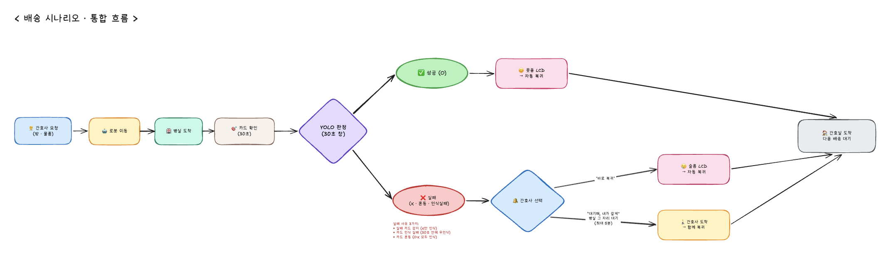

# PinkyCare — 배송 시나리오

간호사가 병실로 물건을 보내달라고 요청하면, 로봇이 스스로 이동해 물건을 전달하고,
도착한 자리에서 카드를 인식해 성공/실패를 판단한 뒤, 간호사에게 결과를 알리고
간호실로 돌아오는 흐름입니다.

- **버전**: v3 (비개발자용 요약)
- **최종 수정일**: 2026-07-08
- **개발자용 상세**: [`api-spec.md`](./api-spec.md) · [`ros2-coordination.md`](./ros2-coordination.md) · [`yolo-plan.md`](./yolo-plan.md)

---

## 1. 한눈에 보기

### 통합 흐름 다이어그램

**흐름 요약**

간호사가 화면에서 방과 물품을 선택해 배송을 요청하면, 로봇이 자율주행으로 병실까지 이동합니다. 병실에 도착하면 카메라를 켜고 **30초간 카드를 확인**하고, 관제 시스템의 YOLO가 이 창이 끝나는 순간 성공/실패를 판정합니다.

**성공(O)** 이면 로봇 LCD에 😊 웃음 표정이 뜨고 그대로 간호실로 자동 복귀합니다.

**실패(X · 혼동 · 인식실패)** 면 로봇이 병실 자리에 정지한 채 간호사에게 알림을 보내고, 간호사는 두 갈래 중 하나를 선택합니다 — **"바로 복귀"** 를 누르면 😢 슬픔 표정 후 로봇이 혼자 돌아오고, **"대기해, 내가 갈게"** 를 누르면 로봇이 병실 그 자리에서 최대 5분 대기하다가 🚶 간호사가 도착하면 함께 걸어서 간호실로 돌아옵니다.

어느 경로든 마지막은 🏠 **간호실 도착 · 다음 배송 대기** 상태로 마무리됩니다.

> 원본: [`diagrams/scenario-unified-flow.excalidraw`](./diagrams/scenario-unified-flow.excalidraw)

---

## 2. 등장인물

| 역할             | 하는 일                                                      |
| ---------------- | ------------------------------------------------------------ |
| **간호사**       | 배송을 요청하고, 결과 알림을 확인                            |
| **화면 (웹 UI)** | 간호사가 조작하는 배송 요청·상태 확인 화면                   |
| **관제 시스템**  | 요청을 받고 로봇을 지휘, 카메라 영상으로 성공/실패 자동 판정 |
| **로봇**         | 병실까지 자율주행, 카메라로 카드 촬영, 표정 화면 표시        |

> 관제 시스템 안에는 카드 인식(AI 모델)이 함께 들어 있어, 로봇이 보낸 카메라 화면을 실시간으로 판별합니다.

---

## 3. 단계별 흐름

### ① 배송 요청

간호사가 화면에서 **방 번호(101/102/103)** 와 **물품**을 카드처럼 선택하고 "요청" 버튼을 누릅니다.
화면은 즉시 **"요청됨"** 상태로 바뀌고, 상세 페이지로 이동합니다.

### ② 이동

관제 시스템이 로봇에게 목적지를 알려주고, 로봇은 자율주행으로 병실로 이동합니다.
화면에는 **"이동 중"** 배지가 표시됩니다.

> 경로 중간에 사람이나 장애물이 있으면 정지·우회 정책이 적용됩니다. _(정책 미정 — §6)_

### ③ 병실 도착 & 카드 확인 (30초)

로봇이 병실에 도착하면 카메라를 켜고 **30초 동안** 카드 이미지를 관제 시스템에 보냅니다.
관제 시스템은 매 프레임마다 카드 종류를 판별해, 30초 창이 끝나는 순간 결과를 결정합니다.

화면에는 **"도착 · 확인 중"** 상태가 표시됩니다.

### ④ 결과 판정

30초 창이 끝나면 관제 시스템이 아래 규칙으로 최종 결과를 확정합니다.

| 감지 상황                                  | 결과                       |
| ------------------------------------------ | -------------------------- |
| **성공 카드(O)** 만 확실히 감지됨          | ✅ 성공                    |
| **실패 카드(X)** 만 확실히 감지됨          | ❌ 실패 — "실패 카드 감지" |
| 30초 안에 **아무 카드도** 확실히 인식 못함 | ❌ 실패 — "카드 인식 실패" |
| **O와 X가 모두** 확실히 감지됨             | ❌ 실패 — "카드 혼동"      |

실패 사유 문구는 §4 참고.

### ⑤ 간호사에게 알림

화면 상태가 **"검증 중"** → **"성공"** 또는 **"실패"** 로 순차 전환되고, 알림 팝업이 뜹니다.

- 성공이면: 성공 알림 팝업
- 실패면: 실패 사유가 담긴 팝업 + 필요 시 간호사가 사유를 **자유 텍스트로 보완**(예: "환자 부재")

### ⑥ 결과에 따른 복귀

성공과 실패의 복귀 방식이 다릅니다.

#### 🟢 성공한 경우 — 자동 복귀

1. 로봇의 LCD에 **핑크 배경 + "배송 성공!"** 을 3초간 표시
2. 이어서 **웃는 얼굴 GIF** 재생
3. 간호실로 자율주행 복귀
4. 다음 배송 대기 상태로 진입

#### 🔴 실패한 경우 — 간호사가 결정

로봇은 **병실 도착 지점 그대로 정지한 채 대기**합니다. 자동으로 복귀하지 않습니다.

간호사 화면에 실패 알림이 뜨면서 두 가지 선택지가 함께 표시됩니다.

| 선택                    | 로봇 동작                                                   |
| ----------------------- | ----------------------------------------------------------- |
| **"바로 복귀"**         | 로봇이 즉시 간호실로 자율주행 복귀 (아래 LCD/GIF 절차 진행) |
| **"대기해, 내가 갈게"** | 로봇이 병실 그 자리에서 대기 → **간호사 도착 후 함께 복귀** |

**"대기" 선택 시 세부 동작**

- 로봇은 **병실 도착 지점**(움직인 좌표 그대로)에서 정지 상태로 대기.
- 예상 대기 시간은 **최대 5분** (간호사 도착까지).
- 간호사가 병실에 도착하면 로봇 LCD에 슬픈 얼굴이 잠시 표시된 뒤, **로봇이 간호사와 함께 간호실로 복귀**합니다.
- 이 경로에서는 로봇 혼자 자동 복귀하지 않습니다. 5분이 지나도 간호사가 오지 않을 때의 처리(재알림 · 에스컬레이션 등)는 §6 미결정.

**"바로 복귀"** 경로는 LCD 표정(**파란 배경 + "배송 실패!" → 슬픈 얼굴 GIF**) 후 로봇 혼자 자율주행 복귀입니다.

> 성공·실패 어느 쪽이든 로봇은 결국 간호실로 돌아오지만, **실패 경로에서는 간호사가 흐름을 통제**한다는 점이 다릅니다.

---

## 4. 실패 사유 3가지

로봇이 병실에 도착한 뒤 30초 동안 카드를 판별해서, 실패인 경우 아래 세 가지 중 하나로 자동 분류됩니다.

| 사유 이름          | 언제 나오나                                   | 간호사 화면 문구                         |
| ------------------ | --------------------------------------------- | ---------------------------------------- |
| **실패 카드 감지** | 실패(X) 카드만 확실히 잡혔을 때               | "실패 카드(X)가 감지되었습니다"          |
| **카드 인식 실패** | 30초 동안 아무 카드도 확실히 잡히지 않았을 때 | "30초 안에 카드를 인식하지 못했습니다"   |
| **카드 혼동**      | 성공(O)과 실패(X)가 모두 확실히 잡혔을 때     | "성공과 실패 카드가 모두 감지되었습니다" |

세 사유 모두 최종 상태는 "실패"로 기록됩니다. 간호사는 팝업에서 사유를 확인하고,
필요하면 자유 문장(예: "환자 부재", "물품 잘못됨")을 덧붙일 수 있습니다.

---

## 5. 데모 시나리오 (2회 주행)

전체 데모는 성공 1번 + 실패 1번, 총 **2회 주행**으로 구성합니다.

### 🅐 1회차 — 101호 배송 성공

간호사가 **101호 · "물건"** 을 요청 → 로봇이 101호로 이동 → 도착 후 30초 동안 카드 확인 → **성공(O)** 감지 → 화면에 성공 알림, 로봇 LCD에 **웃는 얼굴** → 간호실 복귀.

**화면 전환**: `[선택] → [이동 중] → [도착·확인 중] → [🎉 성공 알림] → [배송 목록]`

### 🅑 2회차 — 103호 배송 실패 (대기 시연)

간호사가 **103호 · "물건"** 을 요청 → 로봇이 103호로 이동 → 도착 후 30초 동안 카드 확인 → **실패(X)** 감지 → 화면에 **"실패 카드가 감지되었습니다 / 바로 복귀 · 대기 선택"** 알림 → 간호사가 **"대기해, 내가 갈게"** 선택 → 로봇이 병실 그 자리에서 대기 (최대 5분) → 간호사가 병실에 도착 → 로봇 LCD에 **슬픈 얼굴** → 로봇이 간호사와 **함께 걸어서 간호실로 복귀**.

**화면 전환**: `[선택] → [이동 중] → [도착·확인 중] → [⚠ 실패 알림 · 복귀/대기 선택] → [대기 중] → [간호사 도착 · 함께 복귀] → [배송 목록]`

### 예상 소요 시간

| 구간                                 | 시간                  |
| ------------------------------------ | --------------------- |
| 이동 (간호실 → 병실)                 | 15~40초               |
| 카드 확인 창                         | 30초 (고정)           |
| 결과 알림 & 표정                     | 5~10초                |
| (실패 시) 간호사 이동 & 처리         | 30~60초 (데모 실측)   |
| 복귀 (병실 → 간호실)                 | 20~50초               |
| **1회 주행 (성공)**                  | **약 1분 30초 ~ 2분** |
| **1회 주행 (실패 · 대기 시연 포함)** | **약 2분 ~ 3분**      |
| **2회 데모 전체**                    | **약 3분 30초 ~ 5분** |

> 실패 대기의 상한은 5분이지만 데모에서는 간호사가 즉시 반응하도록 시연합니다.

---

## 6. 아직 정해야 할 것들

데모 리허설 전까지 팀 논의가 필요한 사항입니다.

1. **장애물 대응 정책** — 이동 중 사람·물건을 만났을 때 정지할지, 돌아갈지, 알림을 보낼지.
2. **알림 UI 방식** — 팝업 모달인지 토스트인지, 소리를 낼지.
3. **"물건" 최종 명칭** — 실제 물품 이름 확정 (약/기저귀/혈당측정키트 등).
4. **표정 화면 리소스** — 웃는/슬픈 얼굴 GIF 파일 확정 및 배포 경로.
5. **오류 상황 처리** — 로봇이 목적지에 못 갈 때, 통신이 끊길 때 어떻게 복귀시킬지.
6. **"함께 복귀" 방식** — 로봇이 간호사와 어떻게 이동할지 (자동 팔로우 / 수동 조작 / 나란히 자율주행). 로봇 담당자와 확정 필요.
7. **간호사 미응답 시 처리** — 5분이 지나도 간호사가 병실에 오지 않을 때: 알림 재전송 · 다른 간호사 에스컬레이션 · 최종 자동 복귀 여부 등.
8. **함께 복귀 시작 트리거** — 간호사가 병실에 도착한 사실을 로봇/시스템이 어떻게 인지할지 (앱 버튼 / 로봇 자체 버튼 / 자동 인식).

### ✅ 확정된 것

- **실패 시 자동 복귀 안 함** — 로봇은 간호사의 선택("바로 복귀" / "대기해, 내가 갈게") 을 기다림.
- **대기 위치** — 로봇이 병실에 도착한 그 좌표(움직이지 않음).
- **예상 대기 시간** — **최대 5분** (간호사 도착까지).
- **"대기" 이후 흐름** — 로봇 혼자 자동 복귀하지 않고, **간호사와 함께 간호실로 복귀**.

---

## 부록 — 로봇이 다녀오는 위치

| 위치                  | 비고                  |
| --------------------- | --------------------- |
| 간호실 (원점)         | 로봇의 대기·복귀 지점 |
| 101호 · 102호 · 103호 | 데모용 병실 3곳       |

카드 확인 시간은 **30초 고정**, 도착 판정 임계값 등 세부 수치는 개발자 문서를 참고하세요.
